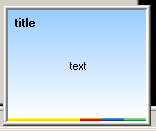

# TMsnPopUp
The TMsnPopUp component is created to mimic the behavior of the popup windows that can be seen in MSN/Windows Messenger from Microsoft. TMsnPopup is fully customizable, so you can give it your own look & feel.

The following picture shows what a default TMsnPopup window looks like. Almost everything can be changed: custom gradients, custom background bitmap, custom title & text fonts, etc.



To achieve this, the following fragment of Delphi-code could be used:

```delphi
procedure TForm1.Button3Click(Sender: TObject);
begin
  MSNPopUp1.ShowPopUp;
end;
```

Just to show what you can change to the window, another screenshot of the TMsnPopup component is included here. All this can be changed through the Object Inspector.


